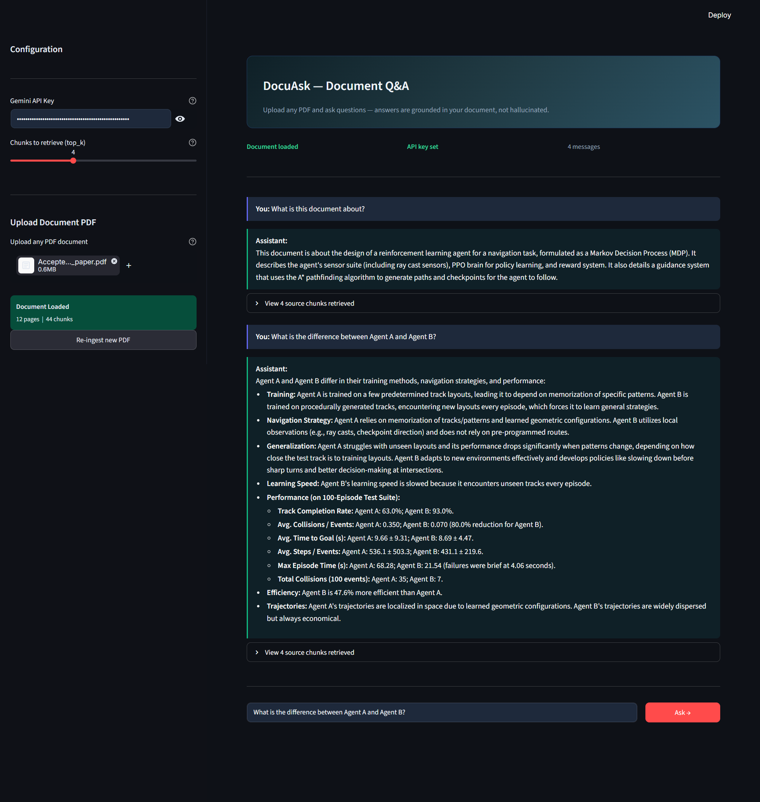

# Document Q&A System using RAG

A production-style **Retrieval-Augmented Generation (RAG)** pipeline that lets you upload any PDF and ask questions about it. Answers are grounded in the document content — not hallucinated.

Built with **LangChain (LCEL)**, **Google Gemini 2.5 Flash**, **ChromaDB**, **FastAPI**, and **Streamlit**.

---

## Demo

> Upload a PDF -> Ask questions -> Get grounded answers with source chunks



---

## Architecture

```
PDF Upload
    │
    ▼
PyMuPDF (text extraction)
    │
    ▼
RecursiveCharacterTextSplitter (800 char chunks, 100 overlap)
    │
    ▼
HuggingFace Embeddings (all-MiniLM-L6-v2)
    │
    ▼
ChromaDB (local vector store)
    │
    ▼
User Question ──► Similarity Search (top-k chunks)
                        │
                        ▼
              LangChain LCEL Pipeline
              {context} + {question}
                        │
                        ▼
              Gemini 2.5 Flash (LLM)
                        │
                        ▼
              Grounded Answer + Source Chunks
```

---

## Tech Stack

| Layer | Technology |
|---|---|
| LLM | Google Gemini 2.5 Flash |
| RAG Framework | LangChain 1.x (LCEL) |
| Vector Store | ChromaDB (local) |
| Embeddings | HuggingFace `all-MiniLM-L6-v2` |
| PDF Parsing | PyMuPDF (fitz) |
| Backend API | FastAPI |
| Frontend UI | Streamlit |

---

## Project Structure

```
document-qa-rag/
│
├── main.py            # FastAPI backend (REST API)
├── rag_pipeline.py    # Core RAG logic (ingest + QA chain)
├── app.py             # Streamlit frontend
├── requirements.txt   # Dependencies
└── .gitignore
```

---

## Getting Started

### 1. Clone the repo

```bash
git clone https://github.com/athakkumar/document-qa-rag.git
cd document-qa-rag
```

### 2. Create a virtual environment

```bash
python -m venv venv
venv\Scripts\activate        # Windows
# source venv/bin/activate   # Mac/Linux
```

### 3. Install dependencies

```bash
pip install -r requirements.txt
```

### 4. Get a free Gemini API key

Go to [aistudio.google.com](https://aistudio.google.com) -> Sign in -> **Get API Key**.
### 5. Run the FastAPI backend

```bash
uvicorn main:app --reload
```

Backend runs at `http://127.0.0.1:8000`  
Swagger UI available at `http://127.0.0.1:8000/docs`

### 6. Run the Streamlit frontend (new terminal)

```bash
streamlit run app.py
```

UI opens at `http://localhost:8501`

---

## API Endpoints

| Method | Endpoint | Description |
|---|---|---|
| `GET` | `/health` | Health check |
| `POST` | `/ingest` | Upload and embed a PDF |
| `POST` | `/ask` | Ask a question about the document |

### Example — `/ask` request

```json
{
  "question": "What are the key findings?",
  "gemini_api_key": "your-api-key",
  "top_k": 4
}
```

### Example — `/ask` response

```json
{
  "question": "What are the key findings?",
  "answer": "The document highlights three key findings...",
  "sources_used": ["chunk 1 text...", "chunk 2 text..."],
  "chunks_retrieved": 4
}
```

---

## How RAG Works

Traditional LLMs hallucinate because they rely purely on training data. RAG fixes this by:

1. **Ingestion** — splitting the document into chunks and storing vector embeddings in ChromaDB
2. **Retrieval** — when a question is asked, semantically similar chunks are retrieved
3. **Generation** — the retrieved chunks are passed as context to the LLM, which answers strictly from them

This means answers are always traceable back to the source document.

---

## Free Tier Limits (Gemini API)

| Model | RPM | RPD | TPM |
|---|---|---|---|
| Gemini 2.5 Flash | 10 | 250 | 250,000 |

Sufficient for development, testing, and portfolio demos.

Note: Models can be swapped manually via editing rag_pipeline.py.

---

## Future Improvements

-  Multi-document support (query across multiple PDFs)
-  Conversation memory (multi-turn Q&A)
-  Docker containerization
-  Cloud deployment (AWS / GCP)
-  LLM observability with LangSmith

---

## Author

**Athak Kumar Verma**  
B.Tech Information Technology — KIET Group of Institutions  
[GitHub](https://github.com/athakkumar) · [LinkedIn](https://www.linkedin.com/in/athak-kumar-b505ba26a)

---

## License

MIT License — free to use, modify, and distribute.
